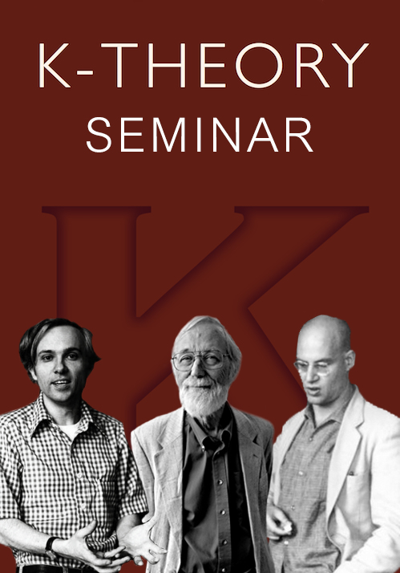
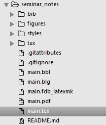

# 讨论班笔记

从右往左依次是A. Grothendieck, J. Milnor, D. Quillen

## 文档结构

- bib文件夹中存放.bib参考文献库，在本地通过Jabref进行管理
- figures包含了文档中需要的图片文件，其中有封面的图片和各章节的图片
- styles包含了所加的宏包和封面等设置
- tex中是各章节的源文件
- main.tex是主文件，通过Sublime Test 3+ XeLaTeX进行编译

---- 

## 缘起

讨论班笔记若从头开始讲的话，可以追溯到2014年夏。2014年夏参加在厦门大学举办的基础数学研究生暑期学校，在其中的某天下午和晚上和一些同学和朋友共同分享了一个`K-理论的发展历史和经典K-理论简介`。

当是时，我还只是刚学习完第一年基础课程其余什么都不知道的情况，就心血来潮自告奋勇花了好几天工夫去准备这样一次报告，其中得到了很多人的鼓励。记得当时从下午3点讲到6点，之后吃完饭又回去继续讲到近10点。想来已经很久没有那样的全身心准备一件事了。

然时隔近两年，当初的稿子还是没有打成电子版，究其原因，无它，唯我懒尔。手稿还在，希望可以随着头发变少带来的见识变短可以把之前的漏洞补上，写出一份较为有趣易读的简介来，那么我也算是可以放下这段心事。

以下的叙述并非按照时间顺序来进行，这是因为很多笔记还没有打成电子版，只能按照大致的时间顺序来描述这份文稿的结构。

## 论文开题

2014年底准备了开题报告，现在看来当时的选择~~入了大坑，~~对现在的工作指明了一条遥遥无期的路。因为当时导师没能听上我的报告，因而还自我感觉良好，实际上其中有很多天真的想法。

2015年5月左右读了第一篇相关的文章，做报告，根据手写的笔记整理出TeX文稿，现在看来还是忽略了很多东西，无论从内容上还是格式上。内容上很多只提了梗概，很多细节还是要去翻原文和当时的纸质笔记，这个问题在后来的笔记里有所改进，也就是在Witt vectors中比较详细的再现了来龙去脉，然而由于文档的线性结构，无法与讲述时的临场发挥和板书所吻合，很多情况下在讲述时更能看出整个内容的结构，我希望可以在讲义中尽量把要达到的目标先讲清楚，再去讲细节。然而由于电子文稿的局限性和我表达能力的局限性，很多内容看起来不连贯，并且可能也有错误，这是需要今后进行仔细修订的。

## 2015年后半年讨论班

主要讲了Witt vectors与NK的关系。实际上到现在还是有很多材料没有概括进来，尤其是一些比较算得上“新”的工具，诸如KV-theory，cyclic homology， THH,TC等。之后讲Weibel的文章，几次下来断断续续也只讲了3页，然而所能包含的东西说短则短，说长则长。

## 2016年

这里采取了说长则长。把相关的一些内容和文章包含进去组成了一部分笔记。由于我懒，很多看了就忘，也来不及打成文稿，所以很多都散落在办公桌，书桌的角落里，希望可以把之前记得只字片语可以组合起来整理出较为完整的一个主题笔记。

## 2014年9月-2015年5月讨论班笔记

这一时期的讨论班笔记以书为主，做的手写笔记很多，然而没有时间打成电子版。这一部分是**将要完成**的事情。

2015年左右用一些时间学了一些语言，比如代数拓扑中的广义上同调，谱等，现在还是没有通。很多时候想做想学的太多，然而落在实处的却很少，希望这份文档可以激励着自己，把所学所见落在实处，一来方便再次参考，二来可以在学习中发现问题。

## TO DO LIST

还有很多未完成的任务，比如最重要的是写出第一篇论文，下面次重要的是写出后一篇论文。当然还有就是把之前的纸质笔记电子化。

- [ ] 纸质笔记的电子化
- [ ] 第一篇论文的产生
- [ ] 第二篇论文的产生
- [ ] 另起炉灶，开始编写翻译文章的tex文稿

## 其它

- bib实际上也算是一些*文章集锦*

----

## 致谢

1. 在厦大暑期班时感谢很多人的支持，诸如Yu Wang, Jianjian Jiang, Bin Wang, Zhangmin Huang, Shuqi Huang, Yansheng Wu等，还有特别感谢室友Weiyuan Zou, Zhen Ba, Yuming Jia的捧场，另外还要感谢Xiang Li, Rongpei Zhou, Yi Han, Wenbo Zhu, Teng Cheng, Haihua Huang, Zhengwei Lin(from Taiwan), Jiangyan Zhao, Yakun Zhang, Yulin Cai, Mi Ling等人在假期一起度过的开心时光。
2. 感想从研一到现在一起上讨论班和一起吃饭的Hang Liu, Dan Yan, Zhengguo Yang, Qian Zheng, Shanjie Chi, Yakun Zhang等师兄姐弟，特别要感谢其中的一起准备讨论班报告的Zhengguo Yang, Shanjie Yang。
3. 感想我的女朋友Y. Ning，~~在此特别想说一句“如果没有你，这份文档早该写完了”。当然不能这么说，~~多亏有你，才让我的生活变得丰富，也认识到很多问题，让我提前觉悟这么早！

## 版本

2016年3月28日 编写README.md

2016年3月29日 添加致谢，文档结构等